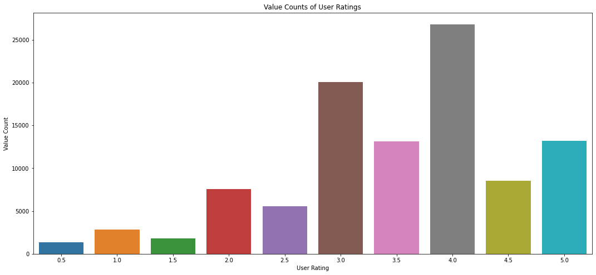
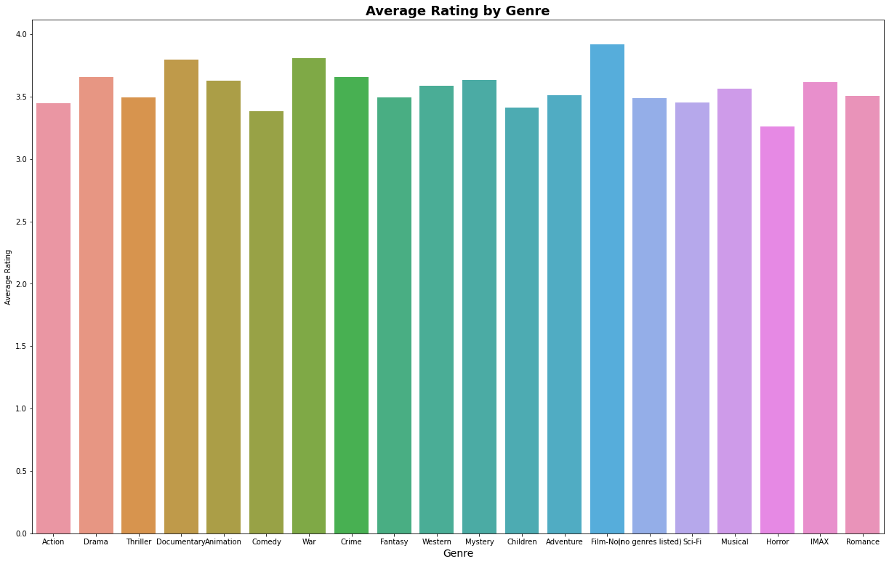
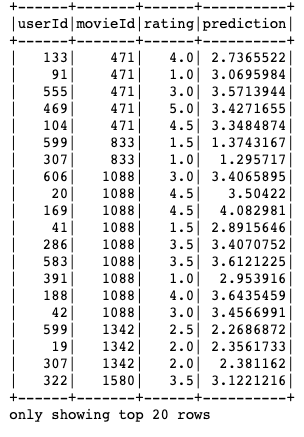
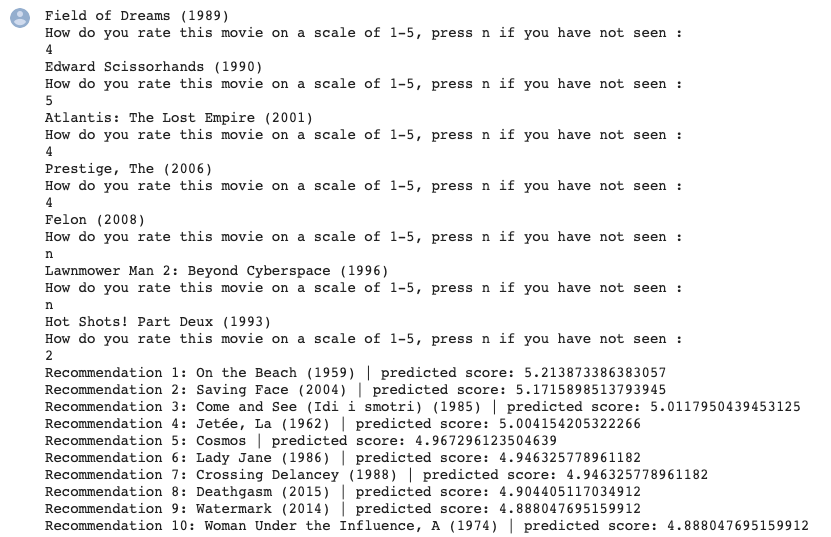

# Module 4 Final Project readme

In this project we wil be making recommendations based on the MovieLens dataset, a collection of user ratings for movies from the GroupLens research lab at the University of Minnesota. We will build a model to provide the top movie recommendations to a user, based off of their ratings of other movies.

## Goals

* Interpret our data and prepare best possible modeling framework
* Understand business problems at hand, using recommendations for customer insights
* Iterate through several models and use Root Mean Square Error (RMSE) as key metric

## Methodologies

* Use collaborative filtering methods to create baseline methods using tools via Surprise algorithms
* Find best parameters using GridSearchCV, apply to SVD modeling and compare with KNN models
* Use matrix factorization with Alternating Least Squares via PySpark, cross validate and determine best parameters
* Build user input function to rate movies, and test using best applicable model

### What trends do we notice in our dataset?

### How accurate is our ALS model?

### What does the user input process look like?

